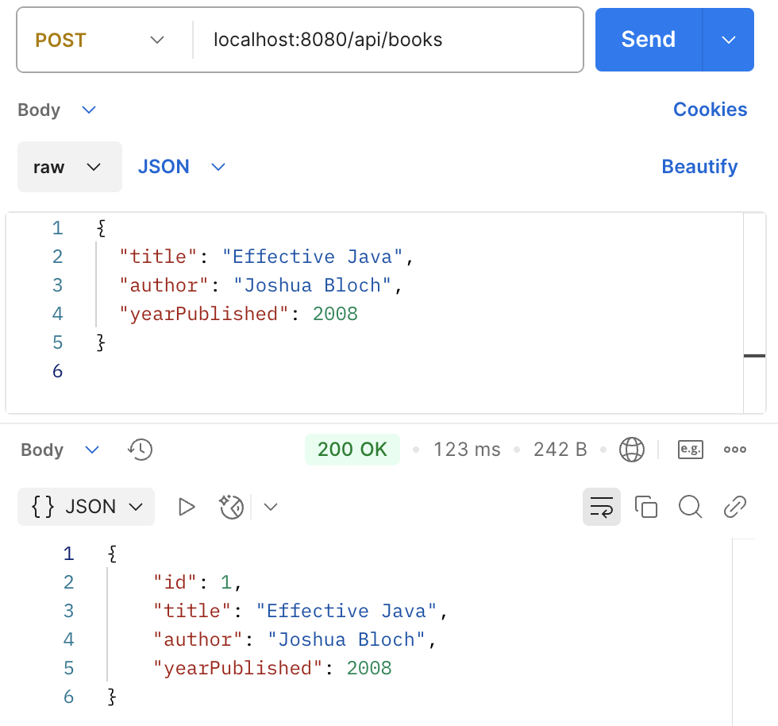
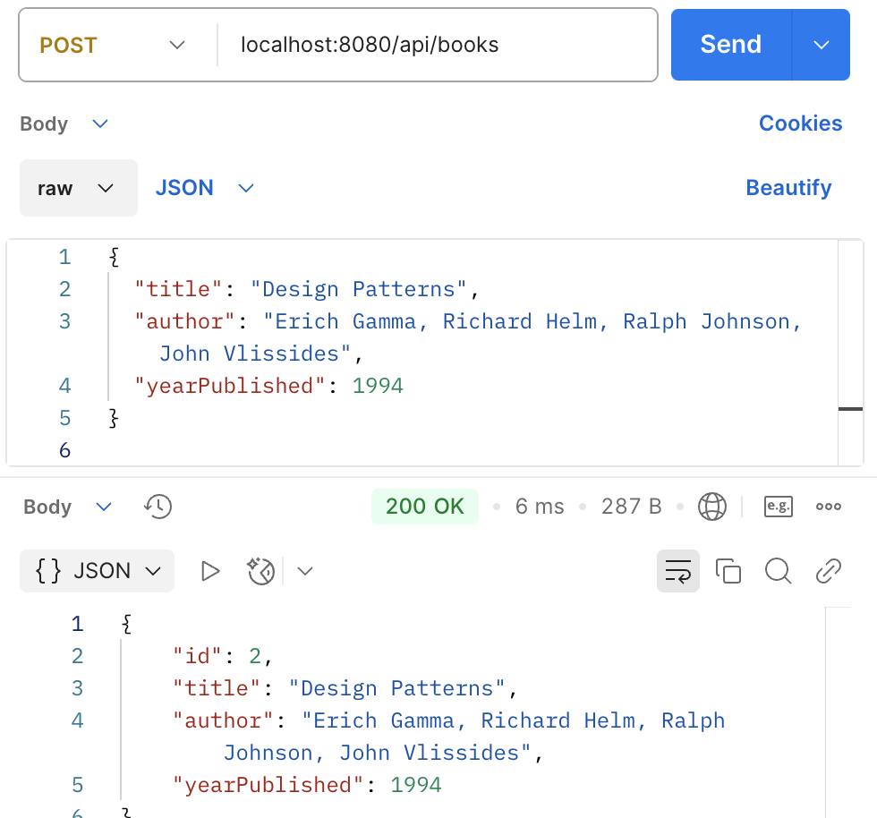
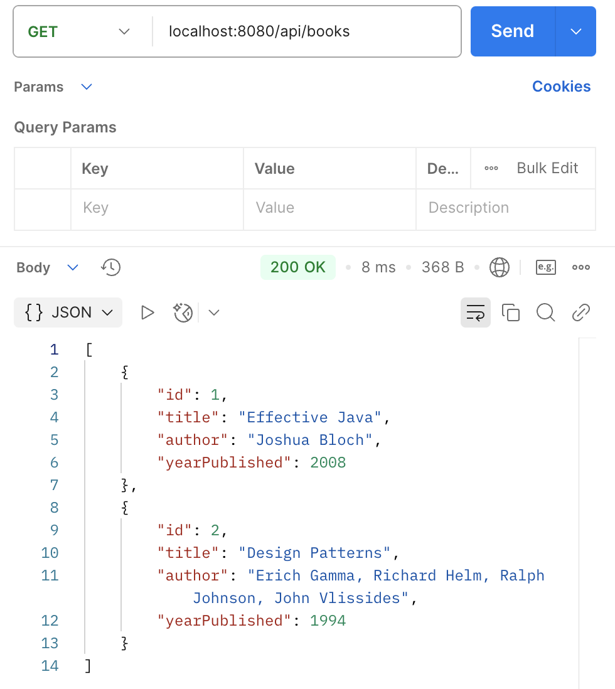
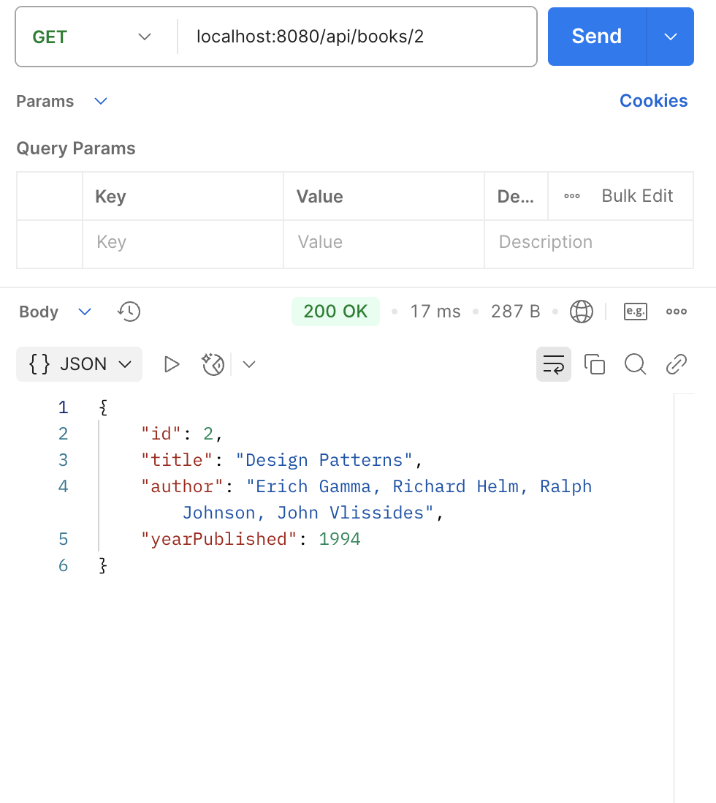
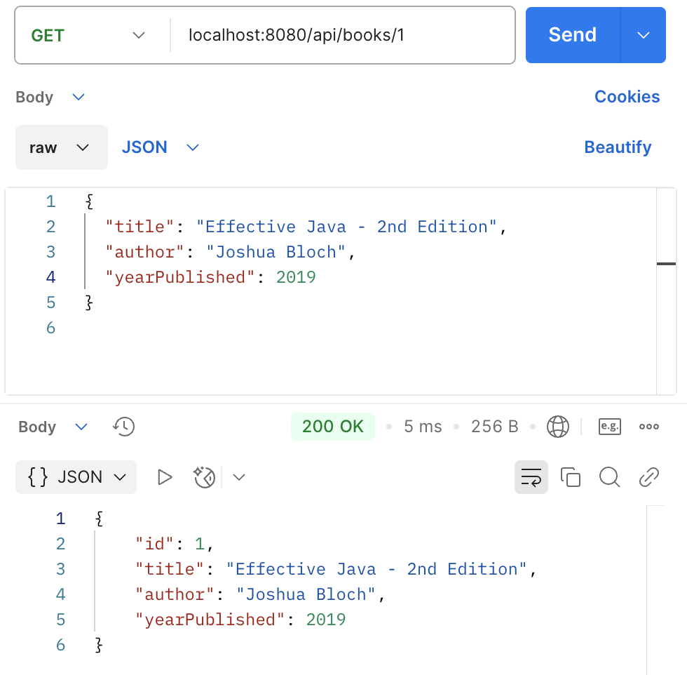
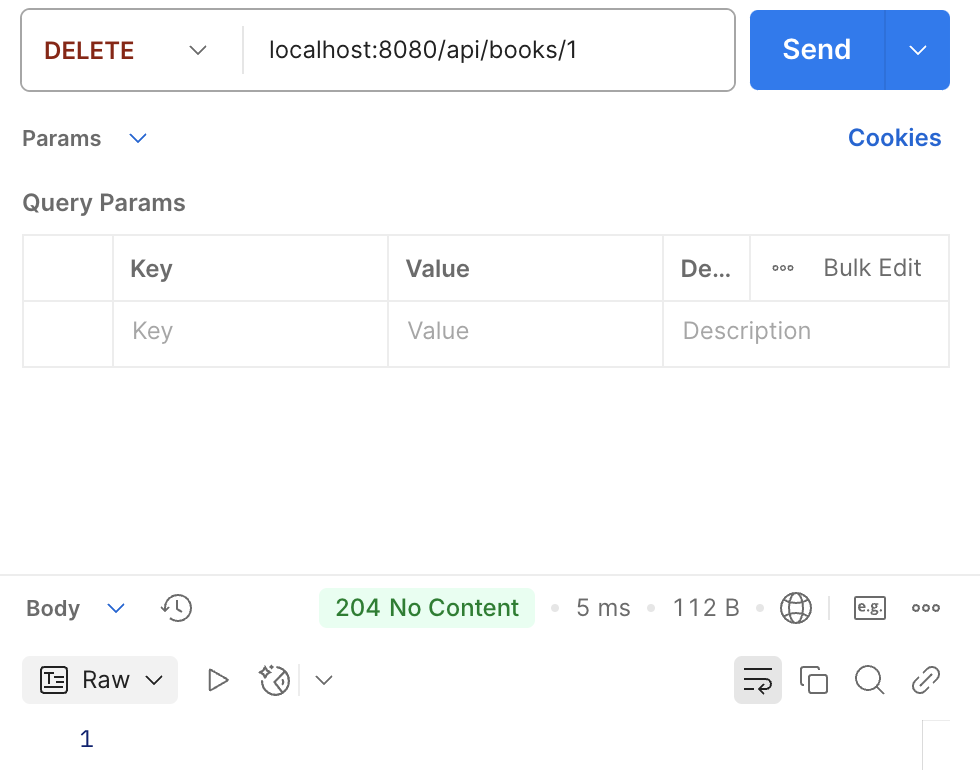

# BOOK API - Spring Boot REST Project
This is a simple Spring Boot REST API project for managing a collection of books. It's built as a learning project to explore Spring Boot and RESTful architecture.

## Postman API Testing Screenshots
### POST - Create book
* Add the first book

* Add the second book

### GET - Retrieve book
* Get all books

* Get book by id

### PUT - Update book
* Update the first book

* View book 1 after updating

### DELETE - Delete book
* Delete book
